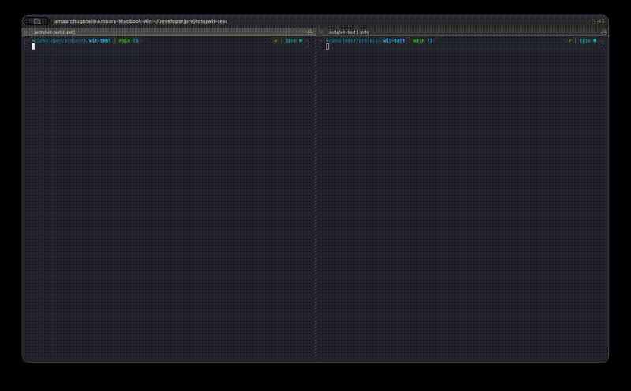

<p align="center">
  
</p>
<p align="center">
  <strong>Agent coordination protocol for shared codebases</strong>
</p>
<p align="center">
  Declare intents. Lock symbols. Detect conflicts. Before code is written.
</p>
<p align="center">
  <a href="https://github.com/amaar-mc/wit/actions/workflows/ci.yml"></a>
  <a href="https://www.npmjs.com/package/wit-protocol"></a>
  <a href="https://github.com/amaar-mc/wit/blob/main/LICENSE"></a>
  <a href="https://github.com/amaar-mc/wit/stargazers"></a>
</p>

---

<p align="center">
  
</p>

**Wit** coordinates multiple AI coding agents working on the same repository simultaneously. It sits between your agents and git — git handles version control, Wit prevents the conflicts.

The name comes from the word itself: the intelligence to coordinate before colliding. It also stands for **W**orkspace **I**ntent **T**racker.

## The Problem

You have three Claude Code instances (or Cursor, Copilot, Devin — any combination) working on the same repo. Without coordination, they each write code independently and produce merge conflicts that waste time and break work.

Git detects conflicts **after** they happen. Wit prevents them **before** code is written.

## How It Works

Wit runs a lightweight daemon in the background. Agents communicate with it over a Unix socket using JSON-RPC. The daemon tracks four things:

| Primitive | What it does | Example |
|-----------|-------------|---------|
| **Intents** | Agent announces planned work scope | "I'm refactoring the auth module" |
| **Locks** | Agent reserves a specific function/type/class | Lock `src/auth.ts:validateToken` |
| **Conflicts** | Daemon warns when intents or locks overlap | "Agent B also declared intent on auth.ts" |
| **Contracts** | Agents agree on function signatures | "validateToken accepts string, returns boolean" |

Intents and locks are **warnings, not blocks**. Agents always get to decide what to do. The only hard enforcement is contracts — a git pre-commit hook blocks commits that violate an accepted contract signature.

## Quick Start

### Prerequisites

Wit requires [Bun](https://bun.sh) (v1.0+). It uses Bun-native APIs for the daemon, SQLite, and process management. Install Bun if you don't have it:

```bash
curl -fsSL https://bun.sh/install | bash
```

### Install the CLI

**From npm:**
```bash
bun install -g wit-protocol
```

**From source:**
```bash
git clone https://github.com/amaar-mc/wit.git
cd wit
bun install
bun link
```

After either method, the `wit` command is available globally.

### Initialize in your project

```bash
wit init
wit start
```

## Contributing

Contributions are welcome! To get started:
1. Fork the repository
2. Create a feature branch (`git checkout -b feature/amazing-feature`)
3. Commit your changes (`git commit -m 'Add some amazing feature'`)
4. Push to the branch (`git push origin feature/amazing-feature`)
5. Open a Pull Request

## License

Distributed under the MIT License. See `LICENSE` for more information.